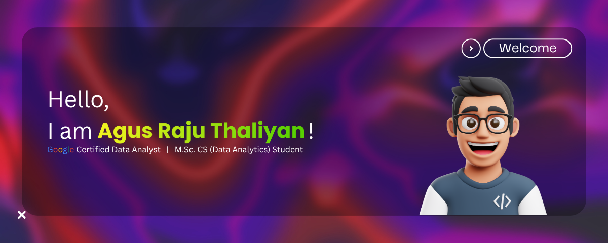

I'm a passionate **Data Analyst** and **Developer** enthusiastic about **AI**, **Data Science**, and **Web Development**.
I love building impactful projects and exploring new technologies.

  <!-- Main tech stack — compact icon grid -->
  
   
  

    

  <!-- AI & Data tooling — compact flat badges for tools without skillicons -->
  
  
  
  
  
  
  
  
  
  
  
  
  
  
  
  
  
  
  
  
  
  
  

  

<!-- ## 📫 **Let's Connect** -->

  

  
  
  

## 📊 **GitHub Stats**

  

