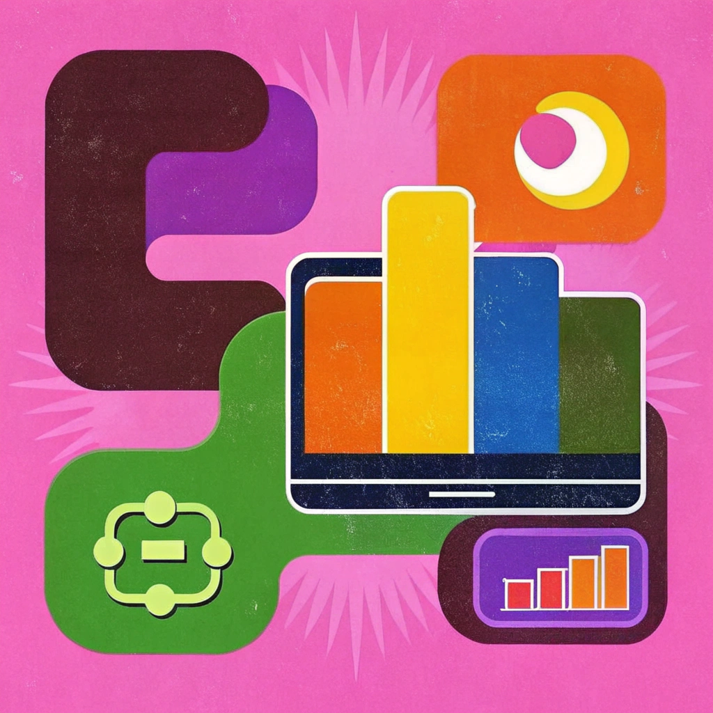
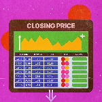

<h1 align="center">👋 Hi there, I'm Agus Raju Thaliyan!</h1>
<link rel="stylesheet" href="styles.css">

  <blockquote style="font-size: 1.25em; font-style: italic; color: #555; max-width: 600px; border-left: 4px solid #007bff; padding-left: 16px; margin: 20px auto;">
    Turning data into insights, one algorithm at a time.
  </blockquote>
  
  

## 🚀 About Me

  <table>
    <tr>
      <td align="center" width="200">
        

        <h4>M.Sc. Computer Science</h4>
        
(Data Analytics)

      </td>
      <td align="center" width="200">
        
  

        <h4>Ex-Business Development Intern</h4>
        
<a href="https://www.cppr.in/" target="_blank">CPPR</a>

      </td>
      <td align="center" width="200">
        

        <h4>Passionate About</h4>
        
Data Analysis Machine Learning Visualization

      </td>
    </tr>
  </table>

## 🛠️ Tech Arsenal

  
   
  
  
  
  
  
  
  
  
  
    
   
    
    
  
  
  

  

## 📂 Key Projects
**Check out some of my projects!** 

| Project | Description |
|---------|-------------|
|  | **[Open-Course Data Analysis Project](https://github.com/agusrajuthaliyan/Open-Course-Data-Analysis-Project)** Data analysis project on the trends and behaviors of student choices during a student elective program. |
|  | **[Stock Market Price Prediction App](https://github.com/agusrajuthaliyan/Stock-Price-Prediction-App)** Streamlit web app that predicts the stock closing price using Random Forest. |

## 📫 **Let's Connect**

  
  
  

  

  ## ️ Tech Arsenal

  
   
  
  
  
  
  
  
  
  
  
     
      

