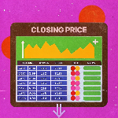

# 👋 Hi there, I'm Agus Raju Thaliyan!

---

### 🔥 Roles
- 🧠 Data Enthusiast
- 🐍 Python Developer
- 📊 Analytics Specialist

---

## 🚀 About Me
| 🎓 M.Sc. Computer Science | 💼 Ex-Business Development Intern | 🌟 Passionate About |
|:------------------------:|:-------------------------------:|:------------------:|
| (Data Analytics)          | [CPPR](https://www.cppr.in/)    | Data Analysis       |
|                           |                                 | Machine Learning    |
|                           |                                 | Visualization       |

---

## 🛠️ Tech Arsenal

---

## 📂 Projects
**Check out some of my projects!**

### [Open-Course Data Analysis Project](https://github.com/agusrajuthaliyan/Open-Course-Data-Analysis-Project)

This data analysis project is a study on the trends and behaviors of student choices during a student elective program.

### [Stock Market Price Prediction App](https://github.com/agusrajuthaliyan/Stock-Price-Prediction-App)

Streamlit-based web application that predicts the closing price of stocks using historical data and a Random Forest model. Users can select any stock to predict the closing price.

---

## 📫 Let's Connect

  
  
  

  

